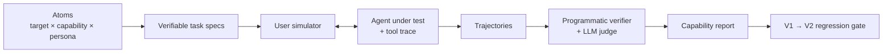

<p align="center" draggable="false">
</p>

## <h1 align="center" id="heading">Session 18: Synthetic Data Generation for Agent Trajectory Evals</h1>

| 📰 Session Sheet | ⏺️ Recording | 🖼️ Slides | 👨‍💻 Repo | 📝 Homework | 📁 Feedback |
| ------------------------------------------------- | -------------------------------------- | -------------------------------------------- | ------------- | ---------------------------------------------------------- | ----------------------------------- |
| [Session 18: Agent Evals via Simulation](https://github.com/AI-Maker-Space/The-AI-Engineering-Certification-v1.0/blob/main/00_Docs/Modules/18_Agent_Evals_Via_Simulation/README.md) |[Recording!](https://us02web.zoom.us/rec/share/qVS3RyoXTDVw-s6DIavehzgfkH9B_gXWzQAqtqS06ejLkA0Iv6KRWPY6AhW-WcsE.gsYLI9Ei2uwaNFtM) <br> passcode: `a@TeW6Eh`| [Session 18 Slides](https://canva.link/cjnasvkvsnxdavf) |You are here! | [Optional Session 18 Assignment](https://forms.gle/o6m16rtLgpjnX9Ch8) | [Feedback 7/30](https://forms.gle/9xJ4QtriEw6phAN29) |

## Prerequisites

In addition to tools from earlier sessions, you'll need:

- An [OpenAI API key](https://platform.openai.com/api-keys) — copy `.env.example` to `.env` and fill it in (`cp .env.example .env`)

# Build 🏗️

A single-answer eval is not enough for agents: they choose tools, chain steps, recover from bad results, and should decline what they can't do. This week we build a τ²-bench-style trajectory eval harness around an EU AI Act assistant — synthetic test tasks composed from atomic parts, an LLM user simulator that drives the agent through real multi-turn conversations, programmatic verification of every trajectory, and a capability report with the per-category regression gate you run on every change to the agent.



- 🤝 Breakout Room #1: Build the Agent and Generate Verifiable Tasks
  - Task 1: Environment Setup
  - Task 2: The Agent Under Test
  - Task 3: Compose Tasks from a DAG
  - Question #1 and Question #2
  - Task 4: The User Simulator and a Full Trajectory
  - Activity #1: Add an Atom

- 🤝 Breakout Room #2: Score Trajectories and Catch Regressions
  - Task 5: Verify and Score Every Trajectory
  - Question #3
  - Task 6: The Capability Report
  - Question #4
  - Task 7: Catch a Regression
  - Activity #2: Fix the Weakest Category

The main notebook is `01_SDG_Agent_Trajectory_Evals.ipynb`. From this folder:

```bash
uv sync
cp .env.example .env   # then fill in your OpenAI API key
```

Then open the notebook in Cursor or VS Code and select the Python/Jupyter environment created by uv.

> ⏱️ **Heads-up on run time.** Every task is a multi-turn conversation and each turn is an LLM call, so Tasks 5 and 7 take ~5 minutes each at the default `SEEDS_PER_CATEGORY = 5`. Results are cached to `artifacts/`, so a second run is instant. Short on time? Set `SEEDS_PER_CATEGORY = 2` (and delete `artifacts/tasks.jsonl` and any `artifacts/eval_*.jsonl`) for a quick ~2-minute run.

# Ship 🚢

A working trajectory eval harness: a capability report for your agent and a regression table that catches what the overall pass rate hides.

### Deliverables

- The completed notebook — all four questions answered and both activities done
- Your capability report and baseline→V2 regression table (keep these outputs in the notebook)
- A five-minute-or-less Loom video

# Share 🚀

Make a social media post about what you built!

### Deliverables

- Make a post on any social media platform about what you built!

Here's a template to get you started:

```
🚀 Exciting News! 🚀

I just built a trajectory eval harness for AI agents — synthetic test tasks, an LLM user simulator, and a per-capability regression gate, powered by τ²-bench-style verifiable evals! 🎉🤖

🔍 Three Key Takeaways:
1️⃣ 
2️⃣ 
3️⃣ 

Let's continue pushing the boundaries of what's possible in AI agent evaluation. Here's to many more innovations! 🚀
Shout out to @AIMakerspace !

#AIEngineering #AgentEvals #LLM

Feel free to reach out if you're curious or would like to collaborate on similar projects! 🤝🔥
```

# Submitting Your Homework

## Main Homework Assignment

Follow these steps to prepare and submit your homework assignment:

1. Complete the 2 activities in the notebook
2. Respond to the 4 questions in the notebook
3. Add, commit and push your modified `01_SDG_Agent_Trajectory_Evals.ipynb` to your GitHub repository.
4. Record a Loom video reviewing what you learned from this session
5. Submit via the homework form (link coming soon)


<summary><h3>Advanced Build (Optional): Dual-Control Trajectory Evals</h3></summary>

> **Note:** Advanced Builds do not count toward assignment completion. Think of them as bonus projects for bragging rights, portfolio building, and continued learning after the cohort.

Push the harness toward the full τ²-bench design:

- **Verifiable environment state.** Give a tool a side effect (e.g. "file a compliance ticket") and add a success check that asserts the *world* changed correctly — the heart of τ²-bench's dual-control idea.
- **Trajectory-level judging.** Score the *path*, not just the final answer: penalize wasted tool calls, reward the shortest correct chain.
- **Adversarial atom mining.** Loop the SDG: when a category passes everything, ask the generator for *harder* variants until it finds a failure — the tail is where the bugs live.
